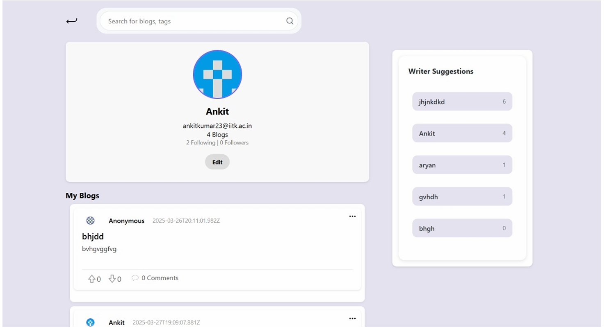

# Echo – Frontend Contribution

This repository contains my frontend contribution to **Echo**, a collaborative blogging platform developed as a course project for **CS253: Software Development and Operations** at IIT Kanpur.

## My Contribution

- Designed and implemented the **Profile Page** using React.
- Developed reusable UI components including:
  - BlogCard
  - WriterSuggestion
- Built responsive layouts using HTML and CSS.
- Integrated the components into the React application structure.

## Technologies Used

- React
- JavaScript (ES6)
- HTML5
- CSS3

## Features

- Responsive profile page
- Reusable React components
- Modular CSS organization
- Clean component hierarchy

## Project Structure

```
src/
├── pages/
│   └── ProfilePage.js
├── components/
│   ├── BlogCard.js
│   └── WriterSuggestion.js
├── styles/
│   └── ProfilePage.css
├── App.js
└── index.js
```

## Running the Project

```bash
npm install
npm start
```

The application will run at:

```
http://localhost:3000
```

## Screenshots

### Profile Page



## Note

This repository contains only my individual frontend contribution. The complete Echo blogging platform was developed collaboratively by a team as part of the course project.
